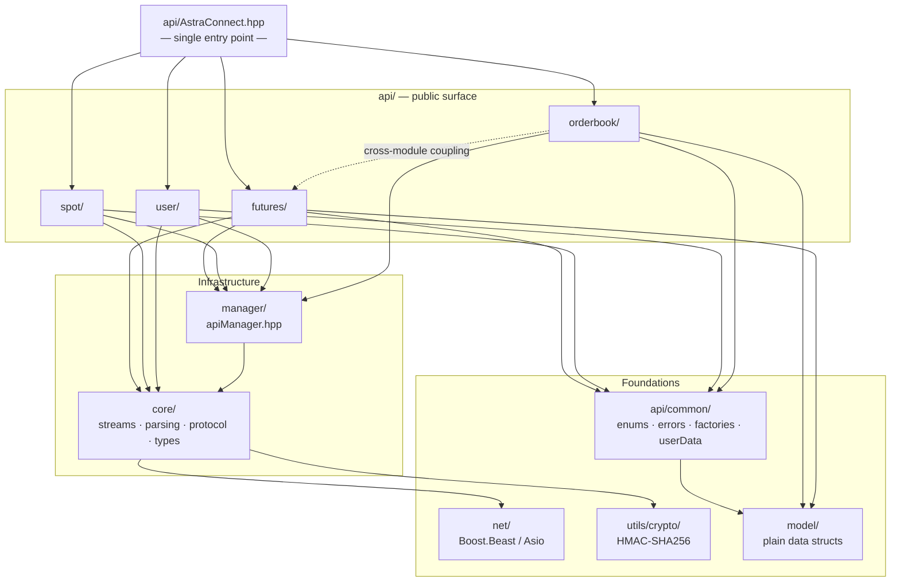
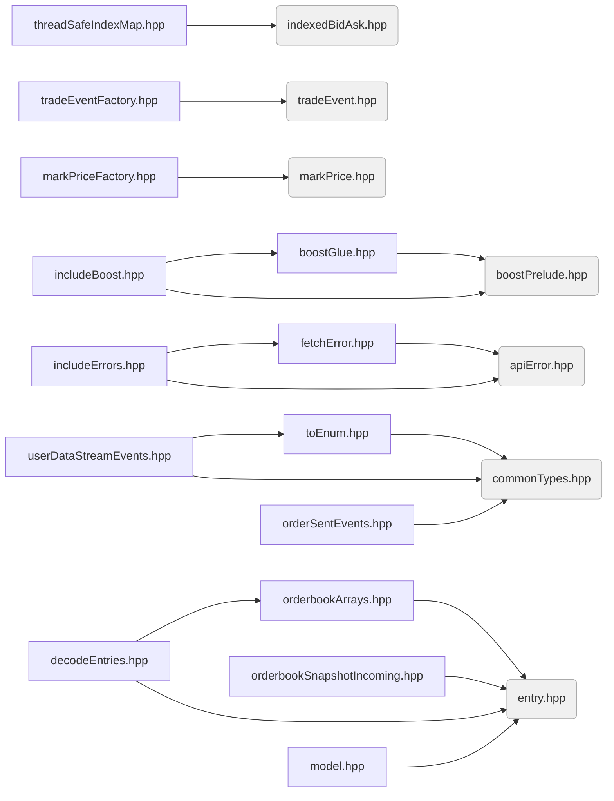
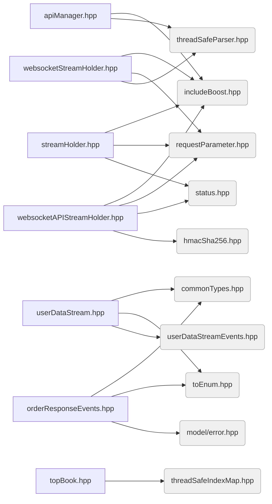
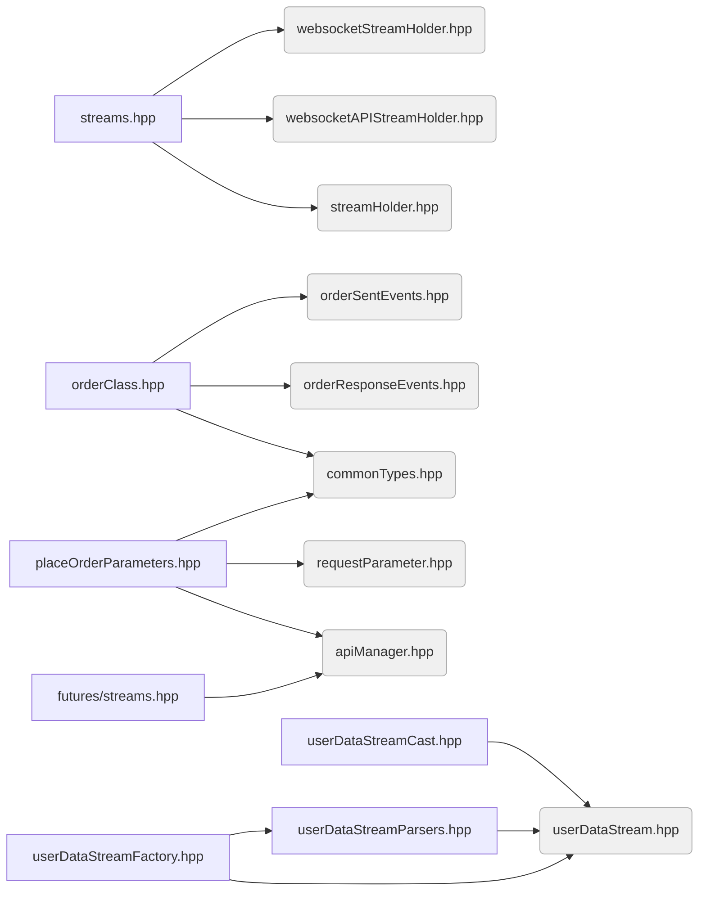
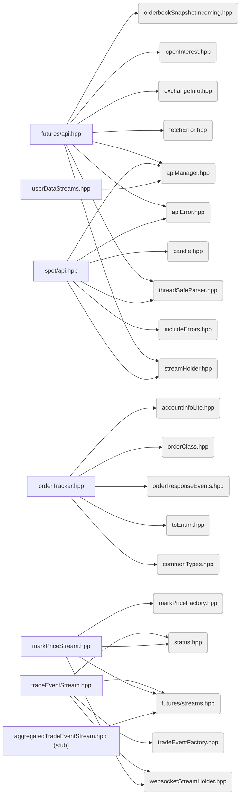
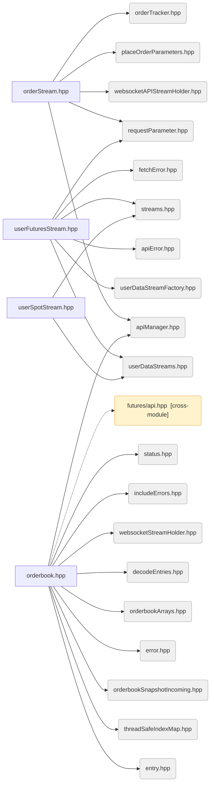

# AstraConnect Dependency Graph

Arrows show `#include` dependencies. Lower layers have no knowledge of higher layers.
`api/orderbook/orderbook.hpp` is a known exception — it currently depends on `api/futures/api.hpp` (cross-module coupling, flagged for refactor).

---

## Layer Overview

---

## Per-File Include Map

### Foundations — no internal dependencies

These files have no internal includes and form the base of the dependency tree. Everything above depends on at least one of these.

| File                                 | Purpose                   |
| ------------------------------------ | ------------------------- |
| `net/boostPrelude.hpp`               | Boost macro configuration |
| `core/protocol/requestParameter.hpp` | REST parameter builder    |
| `core/types/status.hpp`              | Status/connection enums   |
| `core/parsing/threadSafeParser.hpp`  | simdjson wrapper          |
| `utils/crypto/hmacSha256.hpp`        | HMAC signing              |
| `api/common/error/apiError.hpp`      | Base error enum           |
| `api/common/enums/commonTypes.hpp`   | All domain enums          |
| `api/orderbook/indexedBidAsk.hpp`    | Index/price struct        |
| `model/entry.hpp`                    | Price/volume entry        |
| `model/error.hpp`                    | Error model               |
| `model/tradeEvent.hpp`               | Trade event model         |
| `model/markPrice.hpp`                | Mark price model          |
| `model/candle.hpp`                   | Candlestick model         |
| `model/openInterest.hpp`             | Open interest model       |
| `model/exchangeInfo.hpp`             | Exchange info model       |
| `model/accountInfoLite.hpp`          | Account info model        |

---

### Layer 1 — depend only on foundations

Wires together the Boost includes, error hierarchy, enum conversion, data factories, and orderbook primitives. Nothing here knows about streams or the API manager.

| File                                           | Purpose                                      |
| ---------------------------------------------- | -------------------------------------------- |
| `net/boostGlue.hpp`                            | Boost.Beast/Asio forward declarations        |
| `net/includeBoost.hpp`                         | Single include for all Boost headers         |
| `api/common/error/fetchError.hpp`              | HTTP fetch error wrapping apiError           |
| `api/common/error/includeErrors.hpp`           | Convenience header for both error types      |
| `api/common/enums/toEnum.hpp`                  | String-to-enum conversion utilities          |
| `api/common/userData/userDataStreamEvents.hpp` | User data stream event type definitions      |
| `api/common/factory/tradeEventFactory.hpp`     | Constructs TradeEvent from raw stream data   |
| `api/common/factory/markPriceFactory.hpp`      | Constructs MarkPrice from raw stream data    |
| `api/futures/order/orderSentEvents.hpp`        | Events emitted when an order is sent         |
| `api/orderbook/orderbookArrays.hpp`            | Fixed-size bid/ask entry arrays              |
| `api/orderbook/orderbookSnapshotIncoming.hpp`  | Incoming REST snapshot struct                |
| `api/orderbook/threadSafeIndexMap.hpp`         | Lock-free price-to-index map                 |
| `api/orderbook/decodeEntries.hpp`              | Decodes raw JSON entries into Entry structs  |
| `model/model.hpp`                              | Convenience header including all model files |

---

### Layer 2 — core infrastructure

Establishes WebSocket connection holders, the API manager, and the user data stream abstraction. This is where Boost.Asio io_context and SSL live.

| File                                        | Purpose                                                          |
| ------------------------------------------- | ---------------------------------------------------------------- |
| `core/streams/streamHolder.hpp`             | HTTP REST connection lifecycle                                   |
| `core/streams/websocketStreamHolder.hpp`    | WebSocket stream connection and message dispatch                 |
| `core/streams/websocketAPIStreamHolder.hpp` | Authenticated WebSocket stream holder (signs requests with HMAC) |
| `manager/apiManager.hpp`                    | Central manager holding io_context and SSL context               |
| `api/common/userData/userDataStream.hpp`    | Base user data stream with event routing                         |
| `api/futures/order/orderResponseEvents.hpp` | Events received as order execution responses                     |
| `api/orderbook/topBook.hpp`                 | Top-of-book best bid/ask tracker (stub)                          |

---

### Layer 3

Composes the stream infrastructure into usable objects and builds the order and factory abstractions that the API layer consumes.

| File                                            | Purpose                                              |
| ----------------------------------------------- | ---------------------------------------------------- |
| `core/streams/streams.hpp`                      | Aggregates all three stream holders into one include |
| `api/common/userData/userDataStreamCast.hpp`    | Casts base stream events to concrete types           |
| `api/common/userData/userDataStreamParsers.hpp` | Parses raw JSON into user data stream events         |
| `api/common/factory/userDataStreamFactory.hpp`  | Constructs user data stream objects from events      |
| `api/futures/order/orderClass.hpp`              | Order object combining sent and response events      |
| `api/futures/streams.hpp`                       | Convenience header for futures market data streams   |
| `api/futures/order/placeOrderParameters.hpp`    | Builds REST parameter set for order placement        |

---

### Layer 4

The main per-market API files and all active stream implementations. This is the layer most consumers of the SDK interact with indirectly through the top-level include.

| File                                                 | Purpose                                             |
| ---------------------------------------------------- | --------------------------------------------------- |
| `api/futures/api.hpp`                                | Futures REST endpoints and snapshot fetching        |
| `api/spot/api.hpp`                                   | Spot REST endpoints                                 |
| `api/user/userDataStreams.hpp`                       | User data stream session management                 |
| `api/futures/order/orderTracker.hpp`                 | Tracks live order state from response events        |
| `api/futures/streams/tradeEventStream.hpp`           | Live trade event WebSocket stream                   |
| `api/futures/streams/markPriceStream.hpp`            | Live mark price WebSocket stream                    |
| `api/futures/streams/aggregatedTradeEventStream.hpp` | Aggregated trade stream - stub, not yet implemented |

---

### Layer 5

The deepest concrete implementations — the orderbook, order execution stream, and user streams. `orderbook.hpp` carries the only cross-module violation in the graph.

| File                                     | Purpose                                                        |
| ---------------------------------------- | -------------------------------------------------------------- |
| `api/futures/order/orderStream.hpp`      | Authenticated WebSocket stream for order placement and updates |
| `api/user/streams/userFuturesStream.hpp` | Futures user data stream - account and order updates           |
| `api/user/streams/userSpotStream.hpp`    | Spot user data stream - incomplete                             |
| `api/orderbook/orderbook.hpp`            | Lock-free live orderbook with WebSocket feed and REST snapshot |

---

### Top Level

`api/AstraConnect.hpp` is the single public entry point. Including it pulls in all modules above — users of the SDK should include only this file.

---

## Known Issues

| Location                             | Issue                                                                                                    |
| ------------------------------------ | -------------------------------------------------------------------------------------------------------- |
| `api/orderbook/orderbook.hpp`        | Depends on `api/futures/api.hpp` - orderbook should not know about futures REST API                      |
| `api/futures/order/orderTracker.hpp` | Uses relative includes (`"orderResponseEvents.hpp"`, `"orderClass.hpp"`) instead of full paths - fragile |
